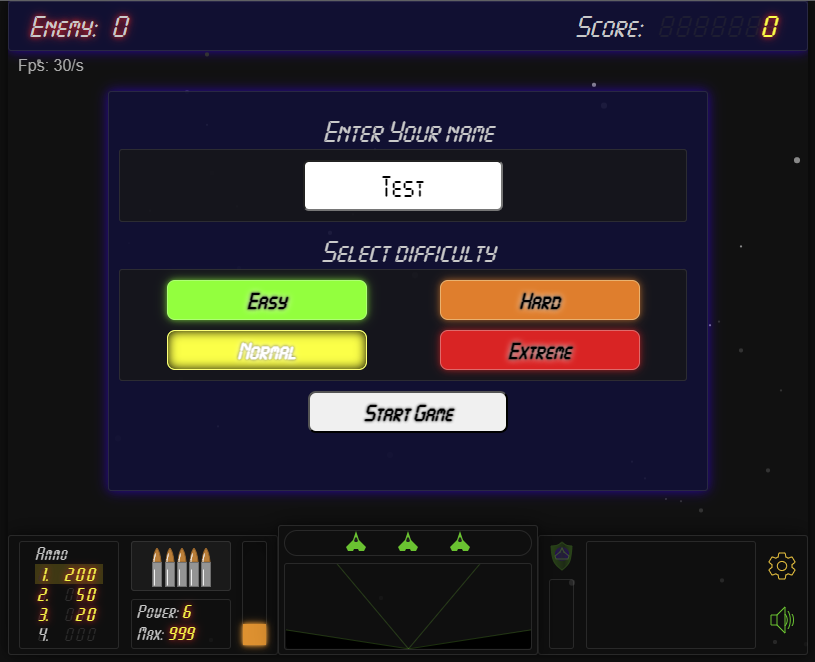

<a name="readme-top"></a>

<a name="PL"></a>
# Space Wars

Projekt gry wykonany jako ćwiczenie i utrwalenie zdobytej wiedzy. Gra "Space Wars" to prosta gra, która polega na eliminowaniu groźnych meteorytów lub wrogich obiektów latających.
W celu zestrzelenia przeciwnika do wyboru masz 3 rodzaje amunicji o różnej sile rażenia i ograniczonej dostępności.

<!-- Część backendową znajdziesz <a href="https://github.com/darkRaf/project-planer-back" target="_blank">tutaj.</a> -->

### Użyte technologie


<!--  -->

<p align="right"><<a href="#readme-top">⬆back to top</a>></p>

## Demo



### Link do strony

<a href="https://space-wars.rafal-13.smallhost.pl/index.html" target="_blank">www.space-wars</a>


<p align="right"><<a href="#readme-top">⬆back to top</a>></p>

## Funkcjonalności

- [x] 1, 2, 3 Wybór rodzaju amunicji.
- [x] 'P' zatrzymanie gry.
- [x] 'M' wyciszenie dźwięków
- [x] 'D' tryb debugowania.
- [x] \2190 Sterowanie statkiem.
- [x] 'Spacja' strzelanie.

<p align="right"><<a href="#readme-top">⬆back to top</a>></p>

## Uruchom lokalnie

### FRONTEND

Sklonuj repozytorium

```bash
  git clone https://github.com/darkRaf/SpaceWars.git
```

Przejdź do folderu

```bash
  cd spacewars
```

<!-- Uruchom

```bash
  uruchom 
``` -->
### BACKEND

W trakcie...

<!-- Clone the backend -->

<!-- ```bash
  git clone https://github.com/darkRaf/project-planer-back
```

Przejdź do folderu

```bash
  cd project-planer-back
```

Zainstaluj zależności

```bash
  npm install
```

Uruchom

```bash
  npm run start
``` -->

## Kontakt

E-mail: [rafał n.](mailto:rafal.nalewajek@gmail.com)

<p align="right"><<a href="#readme-top">⬆back to top</a>></p>

<a name="PL"></a>